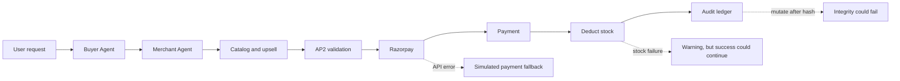
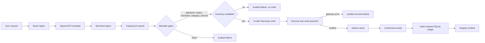

# 🚀 Agentic Commerce Platform — Track 01: AI Growth & Agentic Commerce

> **Dual-agent autonomous commerce system**: A standalone **Buyer Agent** and a standalone **Merchant Agent** communicate via real Google A2A Protocol, real MCP tools, HMAC-SHA256 AP2 Bounded Mandates, Razorpay test-mode payments, and a cryptographic audit ledger.

## The Story: From Autonomous Demo to Safe Prototype

The original prototype could discover products, recommend an upsell, create a Razorpay test order, and show a convincing receipt. The difficult problem was not making the happy path look autonomous; it was proving that an AI could never turn a mistaken decision, a stale inventory record, or a network failure into an unbounded charge.

Three safety gaps made that proof incomplete:

1. The audit event was hashed before its database record ID was added, so the displayed ledger could fail its own integrity check.
2. Inventory was deducted after payment. A race or stock-out could therefore leave a captured payment with no product.
3. A real Razorpay API failure could fall back to a locally simulated payment and appear successful.

The fixed prototype now treats safety checks as transaction gates. The AP2 mandate is signed with the configured secret, checked for signature, expiry, merchant, category, and amount, and inventory is checked before gateway dispatch. Live Razorpay errors are audited and returned as terminal failures; they are never converted into success. Audit IDs are included before hashing, so the hash chain remains verifiable.

### What Was Solved

The result is an end-to-end AI purchasing prototype with three visible guarantees:

- **Allowance:** every checkout is bounded by an HMAC-SHA256 AP2 mandate.
- **Receipts:** catalog decisions, mandate results, gateway events, inventory changes, and failures are recorded in a hash-chained SQLite ledger.
- **Safety net:** offline merchants, invalid mandates, unavailable inventory, and gateway errors stop the flow and explain why no successful purchase was confirmed.

The regression suite now contains **25 passing tests** in simulated mode. The local merchant agent has also been started and responds at `http://localhost:8000`.

### Architecture Before the Fixes



In this version, payment happened before the final inventory check, gateway errors could look like successful simulated payments, and the hash covered a different event from the one displayed.

### Architecture After the Fixes



The important boundary is before `Create Razorpay order`: an invalid mandate or unavailable product cannot reach the payment gateway. Once a real gateway is configured, an API rejection is surfaced as failure rather than hidden by simulation.

---

## 🏗️ Architecture

```
┌──────────────────────────────────────────┐     ┌──────────────────────────────────────────┐
│          BUYER AGENT  (port 8001)         │     │         MERCHANT AGENT  (port 8000)       │
│  buyer_agent/                             │     │  main.py + app/                           │
│                                           │     │                                           │
│  ┌─────────────────────────────────────┐ │     │  /.well-known/agent.json  ← A2A Card     │
│  │  Split-Screen UI (index.html)       │ │     │  /api/a2a/message         ← A2A endpoint  │
│  │  Left:  Chat Console                │ │     │  /mcp                     ← MCP endpoint  │
│  │  Right: Live Agent Monitor          │ │     │  /api/commerce/run-flow   ← Payment       │
│  │  Tabs:  A2A│MCP│Mandate│Pay│Receipt │ │     │  /api/audit/ledger        ← Audit trail   │
│  └─────────────────────────────────────┘ │     │  /api/catalog             ← UCP catalog   │
│                                           │     │                                           │
│  BuyerCore pipeline:                      │     │  Real Protocol Stack:                     │
│    1. Gemini 2.5 Flash → parse intent     │────▶│  - a2a-sdk 1.1.2 (protobuf AgentCard)    │
│    2. AP2 Mandate (HMAC-SHA256)           │ A2A │  - mcp 1.26.0 (Tool, CallToolResult)     │
│    3. MCP search_catalog call             │────▶│  - razorpay 2.0.1 (Orders API)           │
│    4. MCP evaluate_upsell call            │ MCP │  - Gemini text-embedding-004 (semantic)  │
│    5. A2A SendMessageRequest              │────▶│  - SQLite hash-chain audit ledger        │
│    6. /api/commerce/run-flow              │ REST│                                           │
│    7. Stream COMPLETE + receipt           │◀────│                                           │
└──────────────────────────────────────────┘     └──────────────────────────────────────────┘
```

---

## ⚙️ Setup Guide

### Step 1 — Install Dependencies

```bash
pip install -r requirements.txt
```

### Step 2 — Get API Keys (Free)

#### Gemini API Key (Required for real AI)
1. Go to **https://aistudio.google.com/app/apikey**
2. Sign in with your Google account
3. Click **"Create API key"**
4. Copy the key (starts with `AIzaSy...`)

#### Razorpay Test Keys (Required for real payments)
1. Go to **https://dashboard.razorpay.com**
2. Sign up free (no real money involved in test mode)
3. Go to **Settings → API Keys**
4. Click **"Generate Test Key"**
5. Copy **Key ID** (starts with `rzp_test_...`) and **Key Secret**

### Step 3 — Configure `.env`

Open `Razor_pay/.env` and fill in your keys:

```env
# Google AI — get from aistudio.google.com/app/apikey
GEMINI_API_KEY=AIzaSy_your_key_here

# Razorpay Test Mode — get from dashboard.razorpay.com → Settings → API Keys
RAZORPAY_KEY_ID=rzp_test_xxxxxxxxxxxxxxxxxxxx
RAZORPAY_KEY_SECRET=your_secret_here

# Agent URLs (leave as-is for local development)
MERCHANT_AGENT_URL=http://localhost:8000
BUYER_AGENT_URL=http://localhost:8001

# AP2 Mandate crypto secret (change this in production)
AP2_MANDATE_SECRET=AP2_MANDATE_SECRET_AUTHORIZATION_KEY_2026
```

> **Without keys**: Everything still runs in demo/simulated mode. The UI shows a warning banner explaining which keys are missing. All protocol structures (A2A, MCP, AP2) are real — only Razorpay API calls and Gemini AI reasoning are simulated.

---

## 🚀 Quick Start

### Terminal 1 — Merchant Agent (port 8000)

```bash
cd Razor_pay
python main.py
```

Open: http://localhost:8000 | Swagger: http://localhost:8000/docs

### Terminal 2 — Buyer Agent (port 8001)

```bash
cd Razor_pay
python buyer_agent/main.py
```

Open: **http://localhost:8001** ← The buyer UI with split-screen interface

### Terminal 3 — Standalone MCP Server (optional, for external LLM clients)

```bash
cd Razor_pay
python mcp_server.py
```

### Run Tests

```bash
python -m pytest tests/ -v
# Expected: 22/22 passed ✅
```

---

## 🔌 Protocol Endpoints

### Merchant Agent (port 8000)

| Endpoint | Method | Protocol | Description |
|:---|:---|:---|:---|
| `/.well-known/agent.json` | GET | **A2A** | Real `a2a.types.AgentCard` protobuf |
| `/api/a2a/message` | POST | **A2A** | Real `SendMessageRequest → Task → SendMessageResponse` |
| `/mcp` | POST | **MCP** | JSON-RPC 2.0: `tools/list`, `tools/call` |
| `/api/mcp/tools` | GET | **MCP** | `mcp.types.Tool[]` manifest |
| `/api/catalog` | GET | **UCP** | Schema.org JSON-LD agent-readable catalog |
| `/api/commerce/stream` | POST | **REST+SSE** | Full pipeline with live streaming |
| `/api/commerce/run-flow` | POST | **REST** | Synchronous pipeline |
| `/api/audit/ledger` | GET | **REST** | SHA-256 hash-chained audit trail |

### Buyer Agent (port 8001)

| Endpoint | Method | Description |
|:---|:---|:---|
| `/` | GET | Split-screen buyer UI |
| `/api/buyer/health` | GET | Key status + configuration check |
| `/api/buyer/merchant/card` | GET | Fetches merchant's A2A AgentCard |
| `/api/buyer/merchant/tools` | GET | Fetches merchant's MCP tools |
| `/api/buyer/run` | GET | SSE pipeline stream (EventSource) |
| `/api/buyer/a2a/send` | POST | Direct A2A message to merchant |
| `/api/buyer/mcp/call` | POST | Direct MCP tool call |

---

## 📚 Real Protocol Libraries Used

| Protocol | Library | Version | Types Used |
|:---|:---|:---|:---|
| Google A2A | `a2a-sdk` | `1.1.2` | `AgentCard`, `Message`, `Part`, `Task`, `TaskStatus`, `TaskState`, `SendMessageRequest/Response` |
| MCP | `mcp` | `1.26.0` | `Tool`, `ToolAnnotations`, `TextContent`, `CallToolResult`, `ListToolsResult` |
| Razorpay | `razorpay` | `2.0.1` | Test-mode order creation, payment execution, HMAC-SHA256 verification; live API errors fail closed |
| Google AI | `google-genai` | `2.19.0` | `Gemini 2.5 Flash`, `text-embedding-004` |
| AP2 Mandates | stdlib `hmac` | — | HMAC-SHA256 signed bounded spending mandates |

---

## 🏆 Track 01 Bar Compliance

| Requirement | Implementation |
|:---|:---|
| **Grow merchant revenue** | Dynamic upsell engine picks highest-margin add-on within AP2 mandate headroom |
| **Sellable to AI buyers** | Real `AgentCard` + real MCP `Tool[]` + Schema.org UCP catalog |
| **Every money action explainable** | SHA-256 hash-chained SQLite audit ledger at `GET /api/audit/ledger` |
| **Bounded and gated** | HMAC-SHA256 AP2 Mandate required for every payment — budget/merchant/expiry enforced |
| **Audit trail shown** | Full hash-chained event timeline with `integrity_verified: true` |
| **Failures handled gracefully** | Tampered/expired/category-invalid mandate · Budget breach · Merchant offline · Out-of-stock checkout · Razorpay gateway failure · Missing keys/demo mode |
| **Razorpay test-mode APIs** | `razorpay==2.0.1` SDK, real `client.order.create()`, HMAC verification |
| **Agent-to-agent commerce** | Real A2A HTTP calls from buyer → merchant using `a2a-sdk` protobuf types |

---

## 📁 Project Structure

```
Razor_pay/
├── .env                          ← Your API keys (git-ignored)
├── .env.example                  ← Template — copy to .env
├── requirements.txt              ← Pinned production dependencies
├── main.py                       ← Merchant Agent (port 8000)
├── mcp_server.py                 ← Standalone FastMCP stdio server
├── buyer_agent/                  ← Buyer Agent (port 8001)
│   ├── main.py                   ← FastAPI entry point
│   ├── models.py                 ← BuyerIntent, PurchaseRequest
│   ├── static/index.html         ← Split-screen buyer UI
│   └── agent/
│       ├── buyer_core.py         ← Gemini-powered pipeline orchestrator
│       ├── a2a_client.py         ← Real A2A HTTP client (a2a-sdk)
│       ├── mcp_client.py         ← Real MCP HTTP client (mcp.types)
│       └── ap2_mandate.py        ← Standalone HMAC-SHA256 mandate creation
├── app/
│   ├── config.py                 ← Pydantic-settings (loads .env)
│   ├── models.py                 ← Core Pydantic data models
│   ├── protocols/
│   │   ├── a2a.py                ← Real a2a-sdk AgentCard + message handler
│   │   ├── mcp_ucp.py            ← Real mcp.types Tool + CallToolResult
│   │   └── ap2_mandate.py        ← HMAC-SHA256 mandate engine
│   ├── merchant/
│   │   ├── catalog.py            ← TF-IDF + Gemini embedding search
│   │   └── upsell_engine.py      ← Revenue maximizer
│   └── services/
│       ├── embedding_service.py  ← Gemini text-embedding-004 + JSON cache
│       ├── razorpay_service.py   ← Real Razorpay SDK integration
│       ├── audit_ledger.py       ← SHA-256 hash-chain ledger
│       └── database_ledger.py    ← SQLite persistence
└── tests/                        ← 22 automated tests
```
